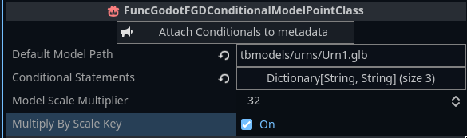

# func_godot_conditional_model_point_class

This is a helper resource to be used with func_godot. Without func_godot this will not work!

This resource has 4 properties on top of the default FuncGodotFGDPointClass properties:

- Default Model Path (ModelDescriptor) (optional): The default path for the model for this path. Leave blank if you do not want a default model.
- Conditional statements (Dictionary[String, ModelDescriptor]) (Optional): A dictionary where the keys are the conditional statements and the values are the model paths.
- Model Scale Multiplier (Integer): The default scale of the model. If multiply by scale key is ticked, this value will be multiplied by the scale key.
- Multiply By Scale Key (Bool): Whether to multiply by the scale key that the entity has. This means if you use a scale of 1.2, visually within Trenchbroom, the model will be scaled by 1.2.

Model Descriptor has 3 parameters
- Path (String): The path to the model that is used
- Frame (int): The integer for the frame of the model. When using a gltf model, this depends on the order of animations in that gltf file, and will index that. The first frame is displayed.
- Skin (int): The integer for the skin of the model. Not 100% sure how this is used for gltf files, but it's there if you need it.

All file paths are relative to the game folder you set in Trenchbroom.

When you have set these values as you see fit, you can press the Attach Conditionals to metadata button. This will attach the updated model metadata to the Meta Properties with the model key. This will overwrite anything previously set to the model key in the Meta Properties dictionary.

These conditional models will only show the model conditionally within Trenchbroom. It is still up to you to change the model to the correct mesh or scene whenever your map builds.

As an example:

Then in Trenchbroom, I can set model_id key for the model I want, set the scale key and voila:

